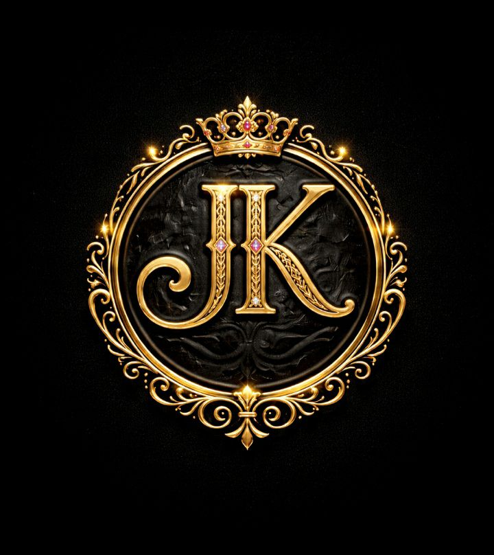

# JAAAKH

### The Future of Digital Finance in the Middle East  
### مستقبل التمويل الرقمي في الشرق الأوسط

---

## About the Project | حول المشروع
JAAAKH is a modern digital financial project focused on speed, security, and ease of use.  
يعد JAAAKH مشروعاً مالياً رقمياً حديثاً يركز على السرعة والأمان وسهولة الاستخدام.  

The project aims to provide fast and low-cost financial transactions across the Middle East and global markets.  
يهدف المشروع إلى توفير معاملات مالية سريعة ومنخفضة التكلفة في الشرق الأوسط والأسواق العالمية.  

---

## Vision | الرؤية
JAAAKH represents innovation, luxury, and advanced financial technology built for the future.  
يمثل JAAAKH الابتكار والفخامة والتقنية المالية المتقدمة المصممة للمستقبل.  

---

## Services | الخدمات
- Artificial Intelligence | الذكاء الاصطناعي  
- Robotics and electronic chips | الروبوتات والشرائح الإلكترونية  
- Automation systems | أنظمة الأتمتة  
- Financial technology (FinTech) | التكنولوجيا المالية  
- Real estate | العقارات  
- Import and export | الاستيراد والتصدير  

---

## Problem | المشكلة
Many countries suffer from:  
تعاني العديد من الدول من:  

- Slow international transfers | بطء التحويلات الدولية  
- High transaction fees | رسوم معاملات مرتفعة  
- Limited access to financial services | محدودية الوصول للخدمات المالية  
- Low trust in traditional systems | انخفاض الثقة بالأنظمة التقليدية  

---

## Solution | الحل
JAAAKH provides a fast, secure, and low-cost digital financial solution designed for modern markets.  
يوفر JAAAKH حلاً مالياً رقمياً سريعاً وآمناً ومنخفض التكلفة مصمم للأسواق الحديثة.  

---

## Contact | التواصل
📱 WhatsApp: https://wa.me/9647829263979